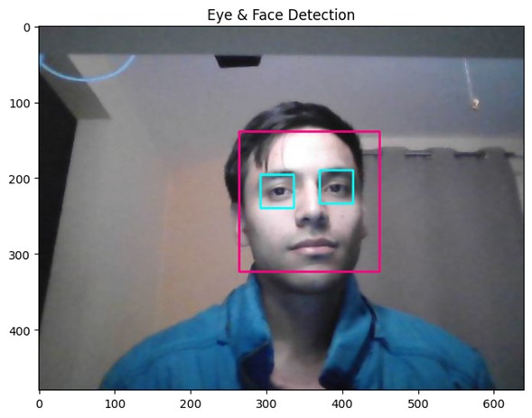

# Computer Vision Projects

This repository contains a collection of my Computer Vision projects, showcasing various techniques and models used to solve different image processing and computer vision tasks. Each project is organized in a Jupyter notebook and covers aspects such as object detection, image segmentation, neural style transfer, and more.

## Projects

### 1. [Captcha OCR Cracker](Captcha_OCR_Cracker.ipynb)
A project focused on Optical Character Recognition (OCR) to crack CAPTCHA images. Techniques include preprocessing, character segmentation, and model training to recognize text in CAPTCHA images.

### 2. [CycleGAN: Turn Horses into Zebras](CycleGAN_Turn_Horses_into_Zebras.ipynb)
An implementation of CycleGAN to transform images of horses into zebras and vice versa. This project explores the use of generative adversarial networks (GANs) for image-to-image translation without paired examples.

### 3. [Face and Eye Detection using Haar Cascade](Face_Eye_Detection_HaarCascade.ipynb)
A project using Haar Cascade classifiers to detect faces and eyes in images. This classic technique is widely used for real-time face detection.

### 4. [Facial Similarity using MTCNN](Facial_Similarity_MTCNN.ipynb)
This project employs the Multi-task Cascaded Convolutional Networks (MTCNN) to detect facial landmarks and compute similarity between faces. Useful for applications in facial recognition and verification.

### 5. [Google Deep Dream](Google_Deep_Dream.ipynb)
An exploration of Google's Deep Dream algorithm to enhance and visualize the patterns learned by convolutional neural networks (CNNs). The project includes techniques to create dream-like images.

### 6. [GradCAM, GradCAM++, and FasterScoreCAM](GradCAM_GradCAMplusplus_and_FasterScoreCAM.ipynb)
A project that demonstrates the use of GradCAM, GradCAM++, and FasterScoreCAM for visualizing where convolutional networks focus on during image classification tasks. These techniques are useful for model interpretability.

### 7. [Image Captioning](Image_Captioning.ipynb)
An implementation of an image captioning model that generates textual descriptions for images. Combines CNNs for image feature extraction and RNNs for sequence generation.

### 8. [Image Segmentation using Keras, U-Net, and SegNet](Image_Segmentation_Keras,_U_Net_and_SegNet.ipynb)
This project covers various image segmentation techniques using Keras, U-Net, and SegNet. It demonstrates how to train and evaluate models that partition an image into segments.

### 9. [Mask R-CNN Demo](Mask_R_CNN_Demo.ipynb)
A demonstration of Mask R-CNN for object detection and instance segmentation. This model not only detects objects in an image but also generates a high-quality segmentation mask for each instance.

### 10. [Mushrooms Detection using Detectron 2](Mushrooms_Detectron_2.ipynb)
A project that uses Detectron 2 to detect and classify different types of mushrooms. The model is trained to recognize various species with high accuracy.

### 11. [Neural Style Transfer with TensorFlow Hub](Neural_Style_2_Transfer_and_TF_Hub.ipynb)
Explores neural style transfer techniques using TensorFlow Hub. This project shows how to apply the artistic style of one image to another while preserving content.

### 12. [Neural Style Transfer](Neural_Style_Transfer.ipynb)
Another project on neural style transfer, demonstrating different techniques to blend the content of one image with the style of another.

### 13. [Object Detection: Gun and Pistol Detector using Scaled YOLOv4](Object_Detection_Gun,_Pistol_Detector_Scaled_YOLOv4.ipynb)
An object detection project using the Scaled YOLOv4 model to detect guns and pistols in images. Highlights the application of YOLO (You Only Look Once) for real-time object detection.

### 14. [Siamese Networks for Face Similarity](Siamese_Networks_Face_Similarity.ipynb)
A project that employs Siamese networks to determine the similarity between faces. This is useful for tasks like face verification and one-shot learning.

### 15. [Super Resolution using SRGAN](Super_Resolution_SRGAN.ipynb)
An implementation of Super-Resolution Generative Adversarial Networks (SRGAN) to enhance the resolution of images. This project showcases how GANs can be used to generate high-resolution images from low-resolution inputs.

### 16. [Vehicle and Pedestrian Detection](Vehicle_Pedestrian_Detection.ipynb)
A project focused on detecting vehicles and pedestrians in images. Utilizes object detection models to identify and classify these objects in real-time scenarios.

### 17. [Visualization: Filter and Class Maximization](Visualisation_Filter_and_Class_Maximisation.ipynb)
This project visualizes the filters and class activations within convolutional neural networks. It provides insights into what the network has learned and which features it considers important for classification.
